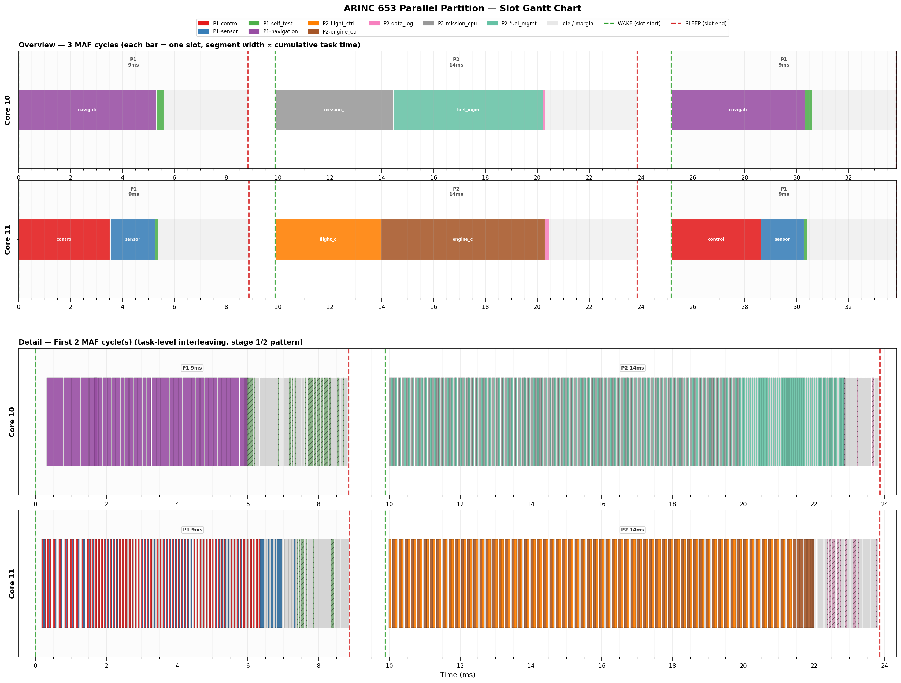

<div align="center">


<em>ARINC 653 · CAST-32A · 同步群组调度</em>

</div>

---

# ARINC 653 多核并行分区实验框架

在 Linux 用户态模拟**多核同步分区调度**——时间分区边界垂直跨越多个物理核心，保证航电分区之间严格的时间隔离。


---

## ✨ 项目解决问题

多核航电系统面临一个根本矛盾：如果在同一时间窗口允许多个分区在不同核心上并发运行，它们会互相污染缓存和总线（吵闹邻居）；如果让它们同步切换，又需要全局时间对齐——标准 Linux 内核调度器做不到这一点。

本框架在不修改内核、不依赖 Hypervisor 的前提下，用纯 C++17 + Linux RT 填补了这个空白。

| 能力 | 实现方式 |
|---|---|
| 🔒 **严格时间隔离** | MAF 全局时钟 + `TIMER_ABSTIME` 绝对时间睡眠，多核相位漂移收敛到零 |
| 🎯 **群组同步调度** | 多个核心在同一绝对时刻唤醒/休眠，实测偏差 ≤ 1µs |
| 🔄 **双层接力调度** | 关键任务先跑满 → 弹性任务接棒填满余量，窗口利用率最大化 |
| 📊 **双通道可观测** | ftrace 内核追踪 **与** 微秒级 CSV 事件日志交叉验证 |
| 🧩 **串行/并行统一** | `PartitionMode::SERIAL` 和 `PartitionMode::PARALLEL` 共用同一套代码路径 |

---

## 🚀 快速开始

### 环境要求

- Linux 系统，支持 `cgroup v2` 和 `SCHED_FIFO`
- GCC 8+（`-std=c++17`）
- Python 3 + `matplotlib`（只用画图脚本需要）
- 至少 2 个空闲 CPU 核心（本示例使用 Core 10–11）

### 第一步 — 内核启动参数（一次性）

```bash
# /etc/default/grub → GRUB_CMDLINE_LINUX 追加：
isolcpus=10-11 nohz_full=10-11 rcu_nocbs=10-11
sudo update-grub && sudo reboot
```

| 参数 | 作用 |
|------|------|
| `isolcpus=10-11` | 禁止内核在 Core 10-11 上调度普通进程 |
| `nohz_full=10-11` | 关闭定时器中断（tickless），最大化可预测性 |
| `rcu_nocbs=10-11` | 迁移 RCU 回调线程，消除内核后台抖动 |

### 第二步 — cgroup 核心隔离

```bash
sudo bash script/setup_core.sh
```

该脚本在 `/sys/fs/cgroup/avionics_partition/` 下创建一个独立的 cpuset 根调度域，把 Core 10-11 划为专属区域。

### 第三步 — 编译 & 运行

```bash
cd src/
g++ -std=c++17 -O2 -pthread main.cpp maf_clock.cpp worker_thread.cpp -o avionics_parallel

# 将当前 shell 放入隔离区
sudo sh -c "echo $$ > /sys/fs/cgroup/avionics_partition/cgroup.procs"

# 启动
sudo ./avionics_parallel
```

**运行效果：**

```
============================================================
  ARINC 653 并行分区 (C++)  分区数: 2  总核心数: 4  MAF: 25ms
============================================================
分区1 | 核10-11 | 时间片0 | 10ms | 并行 ★
分区2 | 核10-11 | 时间片1 | 15ms | 并行 ★
============================================================

=> 运行中 (Ctrl+C 停止)
  [进度] 迭代 85000 | 溢出 0 | 弹性 18240
  [进度] 迭代 128000 | 溢出 0 | 弹性 27400 (完成)

==================== 结果 ====================
  Core 10 | iter:20000 avg:50us wcet:338us | overrun:0 yields:4230
  Core 11 | iter:20000 avg:52us wcet:341us | overrun:0 yields:4230
================================================
```

关键指标：`overrun:0`（无超时）、`yields > 0`（自适应停手生效）、四核弹性全部非零。

---

## 📖 文档导航

| 文档 | 内容 |
|---|---|
| [**01 — 概念基础**](docs/01-概念基础.md) | 串行分区 vs 并行分区的概念定义、运行特征、优劣对比 |
| [**02 — 误区与修正**](docs/02-早期误区与修正.md) | cgroups 的真实定位、为什么 `SCHED_DEADLINE` 不可行 |
| [**03 — 框架原理**](docs/03-框架原理.md) | 三层架构、MAF 时钟系统、EWMA 余量算法、双层接力调度 |
| [**04 — 数据采集**](docs/04-数据采集与分析.md) | ftrace + CSV 双通道可观测体系、KernelShark、plot_slots 使用方法 |
| [**05 — 实验结果**](docs/05-实验结果.md) | 同步精度 ≤ 1µs、负载均衡 1.001:1、弹性覆盖四核 |
| [**06 — 使用指南**](docs/06-框架使用指南.md) | ★ 如何改配置、换算法、自定义负载、调整参数 |

---

## 🧩 配置示例

所有配置集中在 `main.cpp` 的注释块区域，纯 C++，不需要外部配置文件：

```cpp
// 全局参数
constexpr int TOTAL_CYCLES = 20000;          // MAF 周期总数
constexpr auto STRATEGY = WorkerThread::MarginStrategy::EWMA_2SIGMA;

// 并行分区
table.add({
    1, 10, 2, 0, 10,                        // 分区1: Core 10-11, Slot 0, 10ms
    PartitionMode::PARALLEL,
    {
        {1, "nav",  [&]{ mat(55, A1,B1,C1); }, 3500},          // 关键任务
        {2, "ctrl", [&]{ mat(50, A2,B2,C2); }, 3000},          // 关键任务
        {4, "diag", [&]{ mat(10, A3,B3,C3); }, 500, false},    // 弹性任务
    }
});
```

> [!TIP]
> 完整配置手册见 [docs/06-框架使用指南.md](docs/06-框架使用指南.md) —— 涵盖切换分配策略、调整 EWMA 参数、自定义计算负载等。

---

## 📊 结果可视化

```bash
# 双层甘特图（Overview 聚合 + Detail 逐条任务）
python3 src/plot_slots.py trace_log.csv --max-cycles 10 --detail-cycles 3
```



KernelShark 内核级分析：

```bash
# 终端 A：录制
sudo trace-cmd record -e sched:sched_switch -e sched:sched_wakeup -e ftrace:print

# 终端 B：运行
sudo ./avionics_parallel

# Ctrl+C 后用 KernelShark 打开
kernelshark trace.dat
```

---

## 🏗️ 架构总览


| 层 | 模块 | 职责 |
|---|---|---|
| 时钟层 | `maf_clock.hpp/cpp` | 全局时间基准 + 绝对时间睡眠，消除相位漂移 |
| 配置层 | `partition.hpp` · `task_assigner.hpp` | 分区/任务声明 + WCET 感知静态任务分配 |
| 执行层 | `worker_thread.hpp/cpp` | `SCHED_FIFO(99)` + 逐核独立调度 + 双层接力 |

> 核心设计原则：**零跨核通信**。每个核心只看自己的本地任务队列和共享 MAF 时钟，无线程间锁、无 barrier、无跨核原子变量。

---

## 🛠️ 技术栈

`CLOCK_MONOTONIC` · `TIMER_ABSTIME` · `SCHED_FIFO(99)` · `pthread_setaffinity_np` · `cgroup v2 cpuset` · `EWMA + 2σ` · `ftrace/trace_marker` · `KernelShark` · `matplotlib`

---

## 📄 许可协议

MIT License
