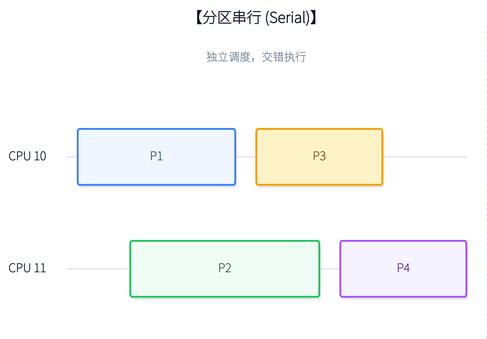
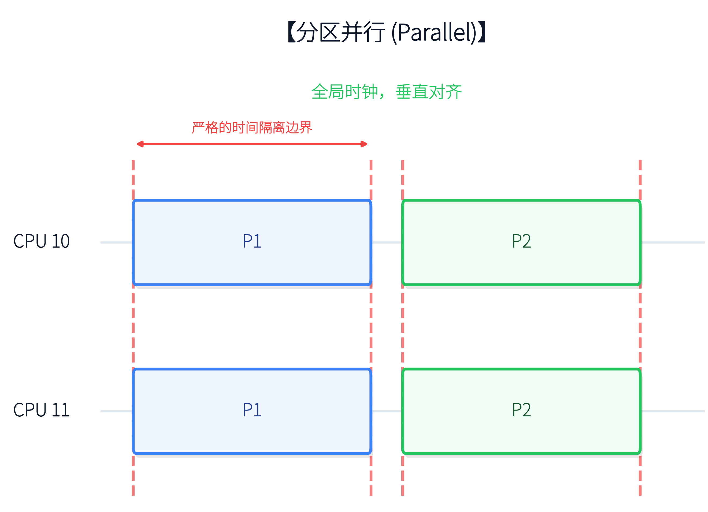
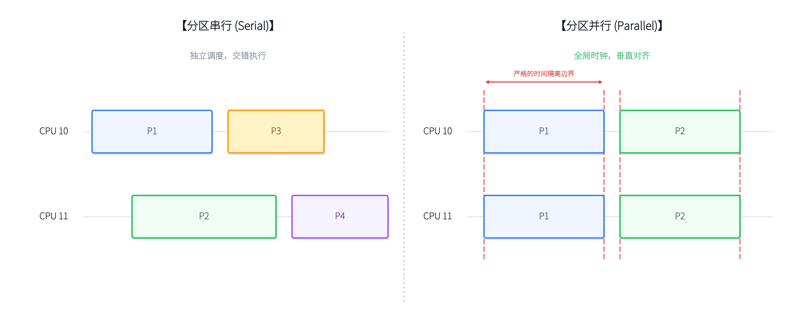

# 串行分区与并行分区 — 概念基础

---

## 1. 什么是时间分区

在航电多核处理器系统（遵循 ARINC 653 及 CAST-32A 指导文件）中，**时间分区的核心目标是保证各任务的严格时间隔离**。

时间分区的基本原理是：将 CPU 时间划分为固定周期的 **MAF（Major Frame，主时间框架）**，每个 MAF 再划分为若干个 **时间片（Slot）**。每个分区（Partition）被分配到一个或多个时间片中运行。不同分区之间在时间上互不重叠，从而保证一个分区的故障（如死循环、超时）不会影响其他分区。

在单核场景下，这个概念非常直观：

但在多核架构下，分区调度出现了两种根本不同的模型。

---

## 2. 分区串行 (Serial Partitioning)

### 2.1 概念定义

分区串行是指处理器中的**每个物理核心都维护着一条独立的时间线**。调度周期的划分局限于单一核心内部，不同核心之间的时间窗口没有强制的全局对齐要求。

### 2.2 运行特征

- **单核独占：** 对于任意一个特定的分区（如分区 P1），在它被分配的时间片内，它仅能占据一个物理核心的算力。
- **宏观交错：** 从整个多核处理器的宏观视角看，核心 A 可能正在运行 P1 和 P3，而核心 B 正在按自己的节奏运行 P2 和 P4。虽然 P1 和 P2 可能在物理时间上是"同时"运行的，但它们分属于各自核心独立的时间表，毫无同步约束。

### 2.3 优势与局限

| 优势 | 局限 |
|------|------|
| 实现相对简单，能较好兼容传统通用操作系统（如标准 Linux 的 CBS 调度器） | 不同核心上的不同分区可在任意时刻并发运行，加剧了对共享硬件资源（如 L3 缓存、内存总线）的非确定性争抢 |
| 不需要全局时钟同步 | 最坏情况执行时间（WCET）分析极其困难，需评估跨核状态组合 |

---

## 3. 分区并行 (Parallel Partitioning)

### 3.1 概念定义

分区并行是指时间分区的边界像"刀切豆腐"一样，**垂直跨越并同步锁定多个物理核心**。整个多核处理器（或被划定的多核簇）遵循一个统一的全局时间主框架（MAF）。

### 3.2 运行特征

- **多核群组调度 (Gang Scheduling)：** 当分区 P1 的时间窗口到来时，P1 会同时接管其所属的多个物理核心（如 Core 10 和 Core 11）。
- **严格同步切换：** 在当前时间片结束时，所有被绑定的核心会同时强制挂起 P1，并极其同步地切换至下一个分区 P2 进行并发执行。

### 3.3 优势与局限

| 优势 | 局限 |
|------|------|
| 多核实时航电系统中最理想的架构——时间窗口内处理器内部只有当前分区的任务在运行 | 底层实现难度极高。在 Linux 等非硬实时系统中需依赖复杂的用户态全局纪元对齐与绝对时间睡眠机制 |
| 从根本上消除了其他分区的干扰 | 需要所有参与核心共享统一时钟源 |
| 多核 WCET 分析变得高度可预测 | `SCHED_DEADLINE` 等原生内核调度器无法直接支持跨核同步 |

---

## 4. 核心差异对比

| 评估维度 | 分区串行 (Independent Scheduling) | 分区并行 (Synchronized Scheduling) |
|----------|-----------------------------------|-------------------------------------|
| 时间轴对齐 | 各核心独立运行，无需严格对齐 | 多核心强同步，垂直严格对齐 |
| 单分区可用算力 | 受限于单核的时间片切割 | 可在一个时间片内聚合多核并行算力 |
| 共享资源干扰 | 极高（需叠加 L3/内存等底层硬件级强隔离） | 极低（时域上天然规避了不同分区的并发争抢） |
| WCET 分析难度 | 极高（需评估跨核状态组合） | 相对较低（架构设计本身实现了干扰隔离） |
| Linux 实现方案 | 原生 `SCHED_DEADLINE` (CBS) 即可满足 | 需自建 MAF 框架 + `SCHED_FIFO` + 绝对时钟对齐 |

---

