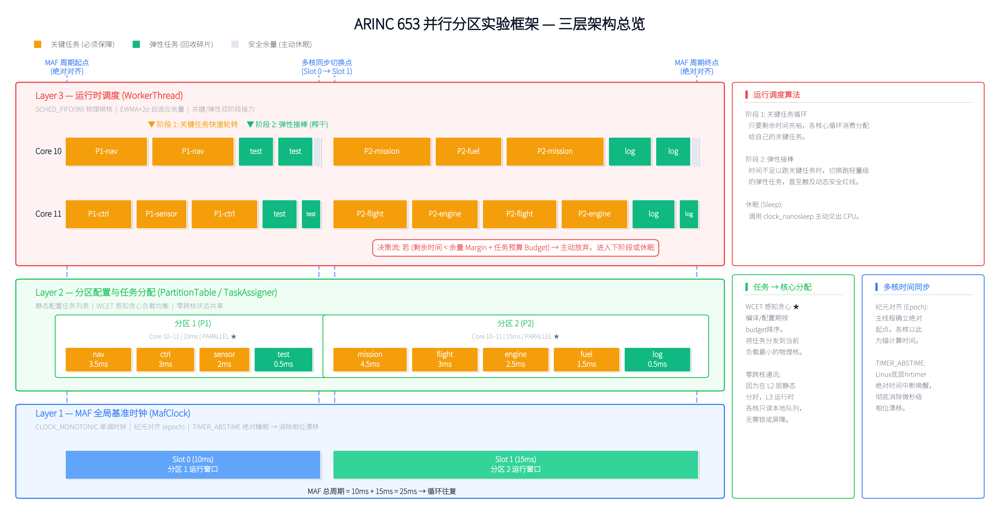
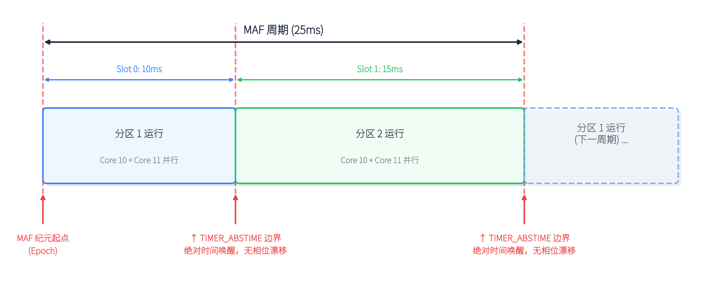
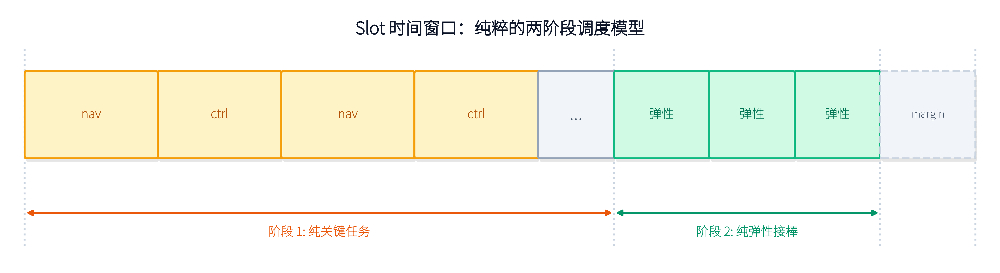

# 代码框架原理 — 三层架构与核心机制

---

## 1. 三层架构总览

本实验框架自底向上分为三层：



| 层级 | 对应模块 | 核心职责 | 关键技术 |
|------|---------|---------|---------|
| Layer 1 — 时钟层 | `maf_clock.hpp/cpp` | 提供全局统一时间基准，驱动所有核心的周期同步 | `CLOCK_MONOTONIC` + `TIMER_ABSTIME` |
| Layer 2 — 配置层 | `partition.hpp` / `task_assigner.hpp` | 声明分区与任务，静态分配任务到核心 | WCET 感知贪心负载均衡 |
| Layer 3 — 执行层 | `worker_thread.hpp/cpp` | 在每个核心上独立执行调度循环 | `SCHED_FIFO(99)` + EWMA 自适应余量 |

**核心设计原则：**

| # | 准则 | 说明 |
|---|------|------|
| 1 | **零跨核通信** | 不使用 barrier/mutex/原子变量，每个核心独立决策 |
| 2 | **独立时钟驱动** | 每个线程只看 `CLOCK_MONOTONIC`，自己判断"该干活还是睡觉" |
| 3 | **绝对时间对齐** | `clock_nanosleep(TIMER_ABSTIME)` 睡到精确的绝对时刻，消除漂移 |
| 4 | **精确单核绑定** | SCHED_FIFO 无 Root Domain 限制，`pthread_setaffinity_np` 精确绑核 |
| 5 | **自适应余量** | EWMA + 2σ 统计安全余量，停止时机由历史数据动态决定 |
| 6 | **故障隔离** | Core 10 缓存未命中卡了 100µs → Core 11 完全无感知 |

---

## 2. Layer 1 — MAF 全局基准时钟

### 2.1 设计动机

在并行分区模型中，所有参与核心必须在统一的时间边界上同步切换分区。传统 Linux 内核调度器无法提供这种用户态可控的全局同步能力。因此需要自建一个时间轴。

### 2.2 时钟源与时间轴

```
时间轴定义：
  绝对时间:  CLOCK_MONOTONIC (系统启动以来的纳秒数，不受系统时间调整影响)
  MAF :  m_epoch_us — 对齐到未来第 2 个 MAF 周期边界  基准点
  MAF偏移 :  offset_us() = clock_gettime() - m_epoch_us  相较于基准点的偏移
  MAF周期内偏移 :  offset_us() % total_us  在当前周期窗口内的偏移
```

**同步对齐**：在启动时计算一个未来的 MAF 边界作为"零点"，所有核心的时间计算都以此为基准偏移，消除各自启动时间不同带来的相位差。

### 2.3 MAF 周期模型



```cpp
// 关键查表方法（全部返回微秒值）
uint64_t slot_duration_us(int slot);      // 时间片时长
uint64_t slot_start_us(int slot);         // 在 MAF 内的起始偏移
bool     in_slot(int slot);               // 当前是否在指定时间片内
uint64_t us_until_slot_end();             // 距当前时间片结束还有多久
```

---

## 3. Layer 2 — 分区配置与任务分配

### 3.1 分区配置 (PartitionTable)

每个分区通过 `PartitionConfig` 结构描述完整属性：

| 配置项 | 说明 | 示例值 |
|--------|------|--------|
| `partition_id` | 分区唯一标识 | 1, 2 |
| `cpu_base` / `cpu_count` | 占用的起始核心号与数量 | Core 10, 2 个核 |
| `maf_slot` | 在 MAF 周期中的时间片编号 | 0（第 1 个时间片） |
| `slot_duration_ms` | 时间片时长（毫秒） | 10ms |
| `mode` | 分区运行模式 | `PARALLEL` / `SERIAL` |

**还有一点：**  `maf_slot` 可被多个分区共享 → 这些分区在同一时间段内并行执行，各自占用不重叠的核心范围。

### 3.2 任务建模 (TaskConfig)

```cpp
struct TaskConfig {
    int         task_id;
    std::string name;              // 可读名称（日志/统计用）
    std::function<void()> workload; // 可替换的计算负载（λ/lambda/函数对象）
    uint64_t    budget_us;         // 核心 预算 (µs)
    bool        is_critical;       // true=关键任务，false=弹性任务
};
```

**任务分两类：**
- **关键任务** (`is_critical = true`)：每个 slot 内必须尽可能多地执行，有明确的 CPU 预算，比如飞控计算等任务
- **弹性任务** (`is_critical = false`)：低优先级，仅在关键任务跑完且余量充足时执行，比如日志记录等零散任务

---

## 4. Layer 3 — 运行时调度核心 (WorkerThread)

### 4.1 工作线程生命周期

```
① allocate_and_warmup()     ← SCHED_OTHER: 内存分配 + 预热
② align_to_next_boundary()  ← 等待 MAF 边界对齐
③ setup_scheduling()        ← SCHED_FIFO(99) + pthread_setaffinity_np 单核绑定
④ 主循环 (run_task_loop)    ← 每个 MAF 周期: 睡眠 → 任务调度 → 主动休眠
```

### 4.2 EWMA 自适应余量算法

SCHED_FIFO 只提供最高优先级不被抢占，但**不具备带宽核算功能**——它不知道"这个任务在剩下的时间里还能不能跑完"。因此需要自行在用户态解决三个问题：

1. 每个任务"理论上需要多少时间" → **budget_us**（离线测量 WCET）
2. 当前还剩下多少时间 → **remain**（实时查询 `us_until_slot_end()`）
3. 任务"实际上可能花多少时间" → **margin**（自适应计算）

**EWMA（指数加权移动平均）更新公式：**

```
μ_new  = α × x       + (1−α) × μ_old        (α = 0.3)
σ²_new = α × (x−μ)²  + (1−α) × σ²_old
margin = μ + k × σ                            (k = 2.0, ~95% 置信上界)
if (margin < 500µs) margin = 500;            // MIN_MARGIN_US 保底
```

**EWMA vs 简单方案的对比：**

| 方案 | 行为 | 问题 |
|------|------|------|
| 不用 margin | `if (remain > budget)` 直接跑 | 无安全缓冲，可能超 slot |
| `last × 1.2` | margin = 上次执行时间 × 1.2 | 单次抖动直接放大 20%，无统计平滑 |
| **EWMA + 2σ** | margin = μ + 2σ, 保底 500µs | μ 平滑了抖动，σ 捕捉真实波动幅度 |

**决策公式：**

```
remain = us_until_slot_end()        // "slot 还剩多少"
margin = calculate_margin()         // "历史执行的统计安全缓冲"
needed = margin + task.budget_us    // "保守估计需要的总时间"

if (remain < needed):
    skip → 试下一个任务
else:
    执行此任务
```

### 4.3 当前使用调度算法

这是框架最核心的调度策略——一个 slot 内的执行分为两个阶段：



**阶段 1 — 纯关键任务循环：**

```
while (true):
    遍历所有关键任务:
        if (剩余时间 ≥ margin + budget_us):
            执行该关键任务 → any_ran = true
    if (any_ran):
        continue  // 回到阶段1顶部，弹性任务不参与
    else:
        break     // 所有关键任务都跑不动 → 进入阶段2
```

**阶段 2 — 弹性任务接棒：**

```
if (弹性任务队列为空):
    break  // 直接退出 slot

while (在 slot 内 AND 剩余时间 ≥ margin + MIN_MARGIN_US):
    遍历弹性任务:
        if (剩余时间 ≥ margin + budget_us): 执行
    if (一轮都没跑成): break  // 余量枯竭
```

**设计要点：**
- 阶段 2 不再回头检查关键任务——避免 µs 级 spin loop 忙等
- 弹性任务在自己的内层循环中反复轮转，直到 margin 耗尽
- 关键和弹性事件泾渭分明，行为可预测

---

## 5. 辅助模块

| 模块 | 文件 | 功能 |
|------|------|------|
| 负载抽象 | `workload.hpp` | 模板化矩阵乘法 `O(SIZE³)`，可通过 `std::function` 替换任意负载 |
| 调度策略 | `scheduler.hpp` | `SCHED_FIFO` 设置 + `pthread_setaffinity_np` CPU 绑定 |
| ftrace 标记 | `trace_marker.hpp` | 写入 `/sys/kernel/tracing/trace_marker`，与 KernelShark 无缝集成 |
| CSV 事件日志 | `slot_logger.hpp` | 线程安全、无缓冲直写，记录 WAKE/SLEEP/TASK/ELASTIC 事件 |
| 可视化 | `plot_slots.py` | 双层甘特图：Overview 聚合视图 + Detail 逐任务放大视图 |

---

## 6. 文件依赖关系

```
main.cpp
  ├── partition.hpp        ← PartitionConfig, TaskConfig, PartitionTable
  ├── maf_clock.hpp/cpp    ← MAF 时钟系统
  ├── worker_thread.hpp/cpp ← EWMA + 任务序列 + 双层接力调度
  ├── task_assigner.hpp    ← WCET 感知两阶段任务分配
  ├── scheduler.hpp        ← SCHED_FIFO + CPU 亲和性
  ├── workload.hpp         ← 矩阵乘法模板
  ├── trace_marker.hpp     ← ftrace 用户态标记
  └── slot_logger.hpp      ← CSV 事件日志
```

---

## 7. 关键设计决策总结

| 问题 | 传统/直觉方案 | 本框架方案 | 原因 |
|------|-------------|-----------|------|
| 为什么不复用内核调度器？ | `SCHED_DEADLINE` (CBS) | `SCHED_FIFO` + 用户态余量 | CBS 无法跨核核定任务图 WCET |
| 如何保证不超时？ | 内核抢占 | EWMA 预测 + 主动放弃 | FIFO 无带宽核算，需自行决策 |
| 如何提高窗口利用率？ | 固定余量 | 弹性任务层 + 阶段 2 接棒 | 关键任务跑完后继续利用剩余时间 |
| 多核如何同步？ | 各自独立 | MAF 纪元 + `TIMER_ABSTIME` | 相位漂移收敛到零 |

---

