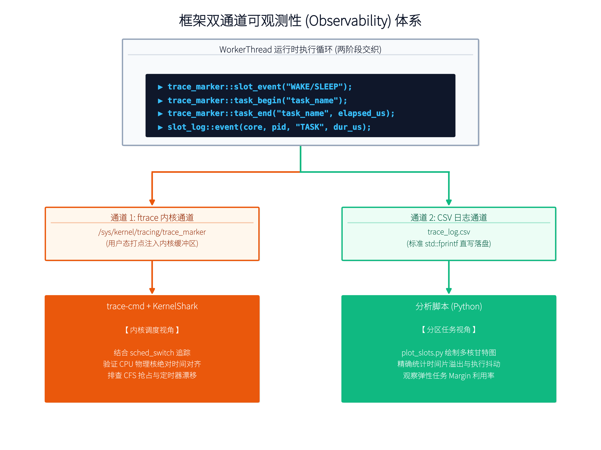
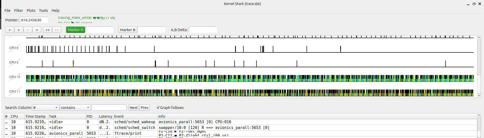

# 数据采集与分析 — 双通道可观测性体系

---

## 1. 总体架构

框架在两个维度上同时输出运行时事件，形成互补的观测体系：



| 对比维度 | 通道 1: ftrace | 通道 2: CSV 日志 |
|---------|--------------|-----------------|
| 数据来源 | 内核 tracefs | 用户态 `fprintf` 直写 |
| 时间基准 | 内核 sched_switch 同轴 | `CLOCK_MONOTONIC` 独立时间戳 |
| 分析工具 | KernelShark (GUI) | Python (`plot_slots.py`) |

---

## 2. 通道 1 — ftrace Print 事件分析

### 2.1 录制方法

```bash
# 终端 A: 录制内核调度事件
sudo trace-cmd record -e sched:sched_switch -e sched:sched_wakeup \
                       -e sched:sched_wakeup_new -e ftrace:print

# 终端 B: 运行分区调度程序
sudo ./avionics_parallel_v8

# 终端 A 按 Ctrl+C 结束录制
kernelshark trace.dat
```

### 2.2 Print 事件打点位置

代码通过 `trace_marker.hpp` 向 `/sys/kernel/tracing/trace_marker` 写入标记，与 `sched_switch` 共享同一时间轴：

```
MAF 周期循环
│
├── [WAKE]  点: trace_marker::slot_event("WAKE")      ← 时间片开始
├── 阶段 1: 纯关键任务循环
│   ├── [TASK] trace_marker::task_begin("P1-nav")     ← 关键任务开始
│   ├── [TASK] trace_marker::task_end("P1-nav", et)   ← 关键任务结束
│   └── ...反复轮转...
├── 阶段 2: 弹性任务接棒
│   ├── [ELASTIC] trace_marker::task_begin("P1-test(弹性)")
│   └── ...反复轮转直至余量枯竭...
└── [SLEEP] 点: trace_marker::slot_event("SLEEP")     ← 时间片结束
```

### 2.3 KernelShark 分析方法

| 分析目标 | 方法 |
|---------|------|
| **多核同步验证** | 同时勾选 Core 10/11 的 print 事件，检查 WAKE 标记是否垂直对齐 |
| **Slot 切换确认** | 对比同一核心上 P1 SLEEP → P2 WAKE 的时间间隔 |
| **与 sched_switch 对比** | 将 print 事件与 sched_switch 叠加，确认 SCHED_FIFO 线程独占核心 |

### 2.4 ftrace 的重要局限

ftrace print 事件在内核环形缓冲区中**批量刷出**——每条记录的时间戳是批次被处理时打上的，而非 `trace_marker` 写入时的 `CLOCK_MONOTONIC` 时刻。因此：

- **不能**用两个 ftrace 记录的时间戳差值来计算 slot 时长
- **可以**确认事件先后顺序和多核同步对齐
- **精确的 slot 时长和利用率**需要 CSV 日志提供



---

## 3. 通道 2 — CSV 事件日志

### 3.1 设计动机

ftrace 虽强，但有不便：
1. 事件粒度不匹配——ftrace 擅长展示线程切换，但分区内以"任务"为单位，任务之间不发生线程切换
2. 批量缓冲——时间戳精度受内核缓冲区刷新影响
3. 数据分析不直观——KernelShark 是 GUI 工具，无法批量统计

### 3.2 CSV 格式

`slot_logger.hpp` 在每次事件发生时立即写入一行（无缓冲模式）：

```csv
timestamp_us, core, partition_id, event, task, duration_us
```

| 字段 | 类型 | 说明 | 示例值 |
|------|------|------|--------|
| `timestamp_us` | uint64 | 相对时间戳（µs），以首次事件为基准 0 | `12345` |
| `core` | int | 物理核心号 | `10`, `11` |
| `partition_id` | int | 分区 ID | `1`, `2` |
| `event` | string | 事件类型 | `WAKE` / `TASK` / `ELASTIC` / `SLEEP` |
| `task` | string | 任务名称（WAKE/SLEEP 时为空） | `P1-navigation` |
| `duration_us` | uint64 | 任务实际耗时（µs） | `2850` |

### 3.3 事件类型语义

| 事件 | 含义 | 与双层接力的对应 |
|------|------|----------------|
| `WAKE` | 线程被 `TIMER_ABSTIME` 唤醒，时间片开始 | `sleep_until_next_slot()` 返回后 |
| `TASK` | 完成一次关键任务的执行 | 阶段 1 中每次 `execute_task()` 后 |
| `ELASTIC` | 完成一次弹性任务的执行 | 阶段 2 弹性接棒中每次 `execute_task()` 后 |
| `SLEEP` | 线程主动放弃 CPU，时间片结束 | `goto slot_done` 后 |

**数据片段示例：**

```csv
timestamp_us,core,partition_id,event,task,duration_us
0,11,1,WAKE,,0             ← Core 11 在 Partition 1 被唤醒
1,10,1,WAKE,,0             ← Core 10 在 Partition 1 被唤醒 （差仅 1µs！）
170,11,1,TASK,P1-control,111   ← Core 11 执行关键任务
222,11,1,TASK,P1-sensor,35
316,10,1,TASK,P1-navigation,239 ← Core 10 同步执行另一个关键任务
```

---

## 4. Python 可视化工具 (`plot_slots.py`)

### 4.1 使用方法

```bash
python3 plot_slots.py [trace_log.csv] [--max-cycles N] [--detail-cycles M]
```

| 参数 | 默认值 | 说明 |
|------|--------|------|
| `trace_log.csv` | 当前目录 | CSV 输入路径 |
| `--max-cycles N` | 10 | Overview 层解析的 MAF 周期数上限 |
| `--detail-cycles M` | 3 | Detail 放大视图展示的周期数 |

### 4.2 数据解析原理

脚本按 `(core, partition_id)` 作为 key 追踪"开放中的 slot"：
1. 遇到 `WAKE` → 开启新 slot，记录起始时间
2. 遇到 `TASK` / `ELASTIC` → 附加到这个 slot 的任务事件列表
3. 遇到 `SLEEP` → 关闭 slot，存入 `(core, pid, t_start, t_end, [task_events])`
4. 每个核心收集够 `--max-cycles` 个完整 slot 后停止

### 4.3 双层甘特图


- **上层 Overview**：每个 slot 一个堆叠柱状图，各段宽度 ∝ 该任务在 slot 内的累计耗时。空闲部分用灰色表示
- **下层 Detail**：前 M 个周期的逐任务条形图，保留阶段 1→2 的完整交替细节。弹性任务用斜线 hatch 标识

### 4.4 关键观察点

| 观察点 | 预期效果 | 异常表现 |
|--------|---------|---------|
| 多核 WAKE 对齐 | 绿色虚线垂直一致 | C10 和 C11 的绿色虚线错开 |
| 阶段分离 | 关键任务密集在前，弹性任务集中在尾 | 弹性和关键事件交叉出现 |
| 空闲比例 | 灰色段在总 slot 中占比小 | 空闲占比 > 15%（余量过大） |
| Slot 边界 | 红色和绿色虚线交替清晰 | 相邻分区之间有大段空白（切换延迟） |

---

**下一章：** [实验结果](05-实验结果.md) — 实测数据与分析
